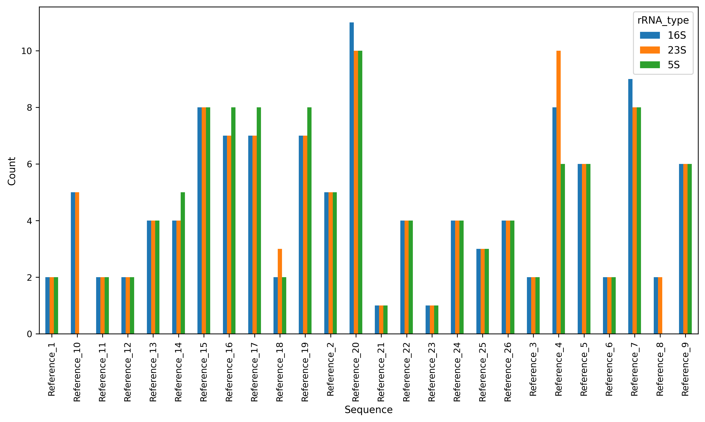
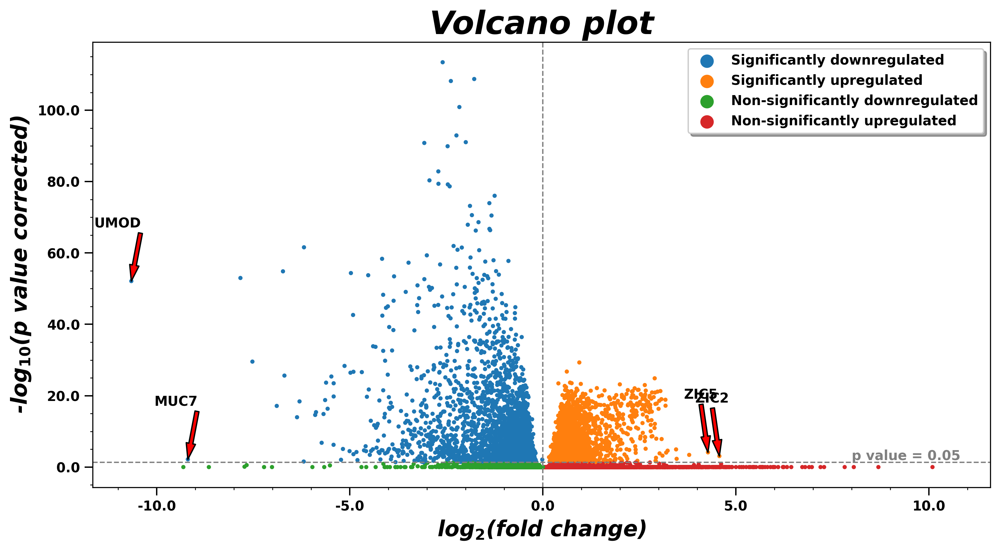
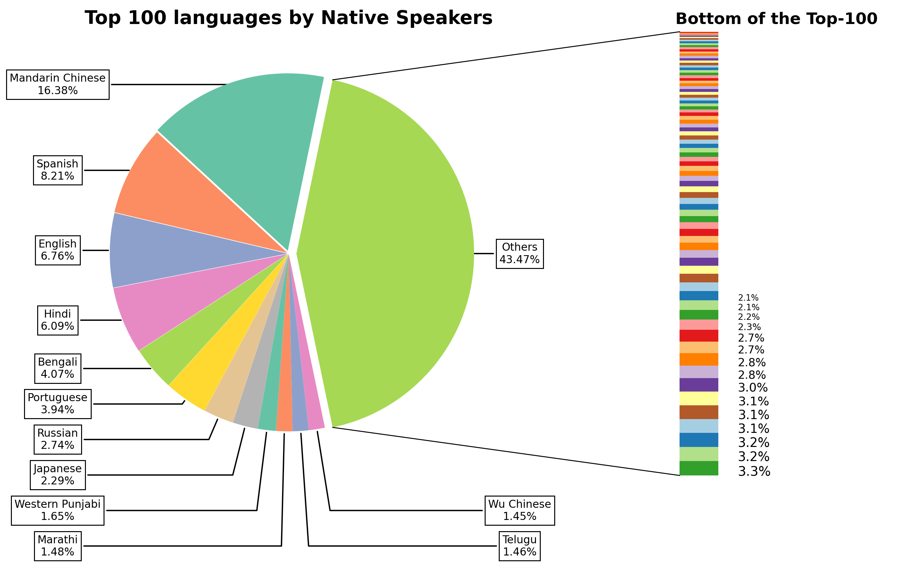

# Pandas and Vizualizations :chart_with_upwards_trend:
## Homework5

Here some solutions for Python `pandas` and plot customization Tasks using `matplotlib` and `seaborn`.

### Files
In this directory there are *four files*: [README.md](./README.md), [requirements.txt](./requirements.txt), [hw5_pandas_and_plots.ipynb](./hw5_pandas_and_plots.ipynb), and [hw5_pandas_and_plots.py](./hw5_pandas_and_plots.py).

- **README.md**: discriptions for files in this directory
- **requirements.txt**: .txt file with the dependencies for *hw5_pandas_and_plots.ipynb* and *.py* 
- **hw5_pandas_and_plots.ipynb**: jupyter notebook with Tasks solutions
- **hw5_pandas_and_plots.py**: .py with only code from jupyter notebook

### Folders
In this directory there are *two folders*: `./data/` and `./plots/`.

- `./data/`: all the files used during this work
- `./plots/`: all .png plots created during this work

### Tasks

### Task1. Real Data

Using [rrna_annotation.gff.gz](./data/rrna_annotation.gff.gz) and [alignment.bed](./data/alignment.bed) files, functions for reading **.gff** and **.bed** files and converting them into `pandas.DataFrame` were created, and reconstruction of `bedtools intersect` were performed:

- `read_gff()`: reads either gziped or not .gff file and transforms it into pandas.DataFrame;
- `read_bed6()`: reads .bed file and transforms it into pandas.DataFrame; 

**rRNA_barplot** visualizes rRNA type counts for each reference genome based on **rrna_annotation.gff** data:

### Task2. Volcano Plot customization

**Volcano plot** is often used to visualize the differential gene expression data. On the X-axis there is *Logarithmic Fold Change*, and *the significance level* (p-value adjusted for multiple comparison) of these changes on the Y-axis. This plot is based on [diffexpr_data.tsv.gz](./data/diffexpr_data.tsv.gz).

### Task3. Pie Chart

[Bar of pie chart](https://matplotlib.org/stable/gallery/pie_and_polar_charts/bar_of_pie.html) is the plot where the first slice of the pie is "exploded" into a bar chart with a further breakdown of said slice's characteristics. Here the visualization of *Top 100 Laguages by Native Speakers* based on [Top_100_Languages.csv](./data/Top_100_Languages.csv) data from [kaggle.com](https://www.kaggle.com/code/narmelan/exploring-the-100-most-spoken-languages-dataset/data).

