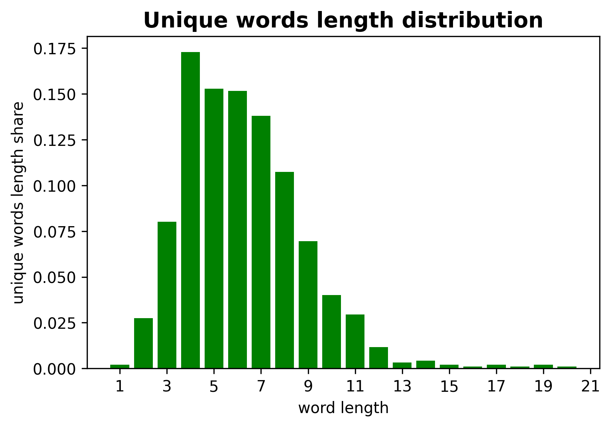

# Regular expressions :paperclip:

# Homework6

Here some solutions for Python `pandas` and plot customization Tasks using `matplotlib` and `seaborn`.

### Files
In this directory there are *four files*: [README.md](./README.md), [requirements.txt](./requirements.txt), [hw6_regex.ipynb](./hw6_regex.ipynb), and [hw6_regex.py](./hw6_regex.py).

- **README.md**: discriptions for files in this directory
- **requirements.txt**: .txt file with the dependencies for *hw6_regex.ipynb* and *.py* 
- **hw6_regex.ipynb**: jupyter notebook with Tasks solutions
- **hw6_regex.py**: .py with only code from jupyter notebook

In this directory there is `./data/` folder with all the files used during this work.

### Tasks

### Task1. FTP links parsing

In [ftps](./data/ftps) there are all **ftp links** from [references](./data/references) file parsed using *regular expression*.

### Tasks2-5. Regular expressions for the short story 2430 A.D. by Isaac Asimov

In this Tasks *regular expressions* were used for searching some information in the short story [2430 A.D.](./data/2430AD) by Isaac Asimov.
In this story there are:

- 11 numbers (written in digits);
- 983 words that contain 'a' vowel (both cases);
- 6 exclamation sentences;
- according to **the unique words length distribution bar plot**, the most of the unique words in this story has the length of four

### Task6. From Russian to Brickish

Function `brickish()` translates Russian to brick language:). *Word, phase, or sentence(s) in Russian* may be set as function parameter.

### Task7. Sentences with a given number of words

Function `n_words_sentences()` parses given text for sentences with n words. For this function set two parameters: *text* for parsing and *number of words in sentences*.
